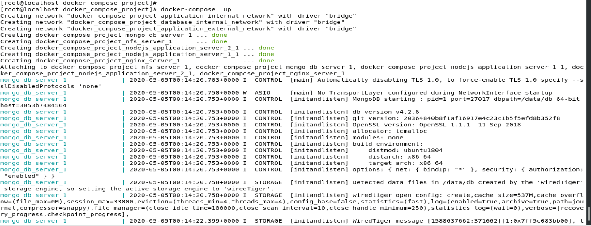
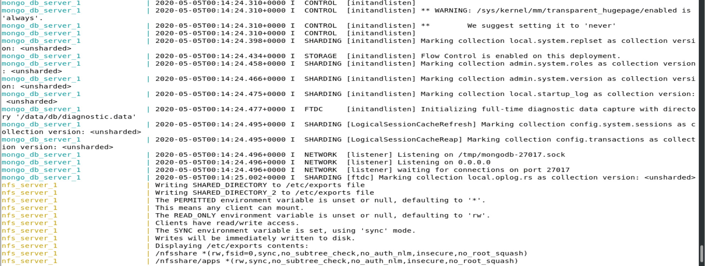
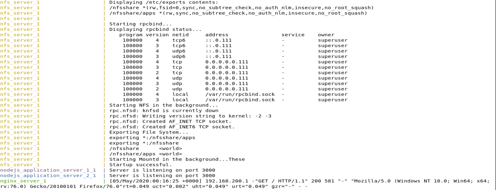
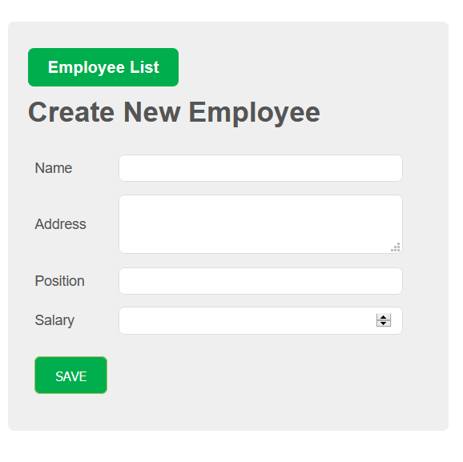
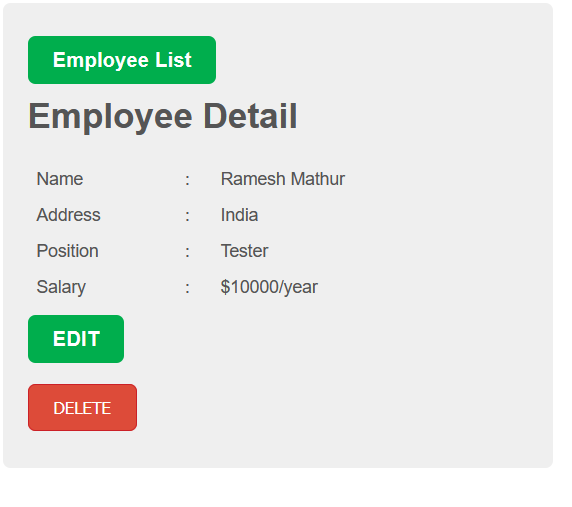
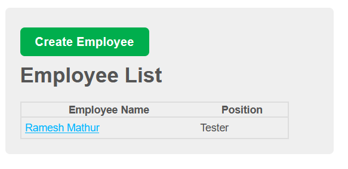

# Docker Compose Project - NodeJs Application


##### The Project Mainly Focuses on Infrastructure Automation

<p align="center">
  
  <br>
  <em>Fig 1.: Project Infrastructure Diagram </em>
</p>


### Pre-requisites:
1. OS: Redhat Enterprise  Linix 8 or Centos8
2. Docker Engine 
3. Docker-compose 

### Technologies/Tools Used:
 - NodeJS 14
 - Angular 9.0
 - Nginx v.18
 - MongoDB Database v 4.2.2

Infrastructure comprises of various components. They are as follows:
1. [Nginx Server](#nginx-server)
2. Application Server
3. Database Server
4. NFS Server

The each component in the project has its own purpose. 

#### Nginx Server

The Nginx Server is used to distribute the load equally  among the Application Servers. The nginx_server container is configured to receive the traffic from external world. The nginx_server container is deployed in seperate network.The container is launched with two network interfaces i.e.; application_external_network and application_internal_network.

Sample docker command
```
docker run -dit -p 80:80 -e NGINX_PORT=80 \
-e APPLICATION_SERVER=nodejs_application_server_1 \
-e APPLICATION_SERVER_2=nodejs_application_server_2 --name nginx_server \
--link nodejs_application_server_1 --link nodejs_application_server_2 \
riteshsoni296/nginx_server:latest
```

`--link` option is used for internal connectivity between the nginx container and application containers based on the container name

The `Environment` Variables that are required are as follows:

a. NGINX_PORT:
    The port on which the nginx_server container to be running, for example 80 or 8080.

 > **Note:**
 > SSL configuration is not yet completed in nginx_server docker image

b. APPLICATION_SERVER_1 and APPLICATION_SERVER_2
  The container name of the aplication_server container hosting the nodejs application 

The logs are stored in seperate volume named `logs_nginx` to preserve the logs even when the container is deleted or corrupted for debugging any issue in application. 

The `Configuration File` is stored at location `/etc/nginx/conf.d/application.conf`. The user customized configuration file can be mounted 

```sh
docker run -it -v nginx.conf:/etc/nginx/conf.d/application.conf --name nginx_server \
                                                  riteshsoni296/nginx_server:latest
```

#### Application Server : NodeJs

The code to be deployed in application server is just a sample project. The project performs CRUD operations using GET and POST APIs in the mongodb Server. The nodejs application code lists the employees details with their current salary. The more employee details can be added using `Create Employees` button. The nodejs_application_server_1 and nodejs_application_server_2 are attached with two different network interfaces i.e the database network(database_internal_network) and application internal network(application_internal_network).

The containers depends on Mongo DB Database i.e mongo_db_server for API calls to fetch and save details to and from the database and display the entries. The code directory 

```
docker run -it --link mongo_db_server -p 3000:3000 --name application-1 riteshsoni296/nodejs_app:latest
```

Port Number 3000 is exposed for applocation connectivity. Since the application servers are internal, they cannot be accessed from outside network except the proxy servers i.e Nginx. The `working Source Code Directory` in the Application server is `/usr/src/app`.


#### Database Server : Mongo Database 

MongoDB version 4.2.2 container image is used to launch the containers with some customisation fo the applications. The database server is launched  in seperate network to keep the data secure from the outside world.

The database network is secured from outside internet access by initialising the `internal` paramter in networks.

```
networks:
    database_internal_network:
        driver: bridge
        internal: "true"
        driver_opts:
            com.docker.network.enable_ipv6: "false"
        ipam:
            driver: default
            config:
                - subnet: "10.120.20.0/24"
```

The `Environment` variables that are passed i.e:

a. MONGO_INITDB_ROOT_USERNAME:

        It is used to define the root account user name in database server

b. MONGO_INITDB_ROOT_PASSWORD: 

        Password for the root account

c. MONGO_INITDB_USERNAME: 

        Application account user_name

d. MONGO_INITDB_PASSWORD: 

        Application User Account password

e. MONGO_INITDB_DATABASE: 

        Application Database

The Database stores the Data in seperate volume to have persistent storage, in case server creashes due to unavoidabale circumstances.
        
#### NFS Server

The NFS Server storage is used to share the /apps volume or application_code volume with application containers.

Docker Compose file to create a nfs volume

```
volumes:
    # Volume for Java Application Code
    application_code:
        driver: local
        driver_opts:
            type: "nfs4"
            o: "addr=10.150.20.12,rw"
            device: ":/apps"
```

Here,
    `addr` is NFS Server IP i.e 10.150.20.12 . It can be NFS Server IP or NFS Server DNS name.
    `device` is configured as /apps instead of /nfsshare/apps, in NFS version 4 due to setting of `fsuid=0` in exports file in NFS Server, the shared volume /nfsshare can be mounted as /.
    
HealthCheck is configured to enable of NFS Server container to start and ready first before application containers.

```
    healthcheck:
            test: ["CMD", "netstat", "-tnlp", "|grep", "2049"]
            interval: 60s
            timeout: 10s
            retries: 5
```
Here,
    `test` paramter is configured to check the availability of the NFS server till `interval` seconds. 
    If the request does not receives any response between `timeout` seconds, the service is marked as unhealthy.
    
The NFS Server is executed as root user to run some priviledged commands i.e mount and writinf mounts in fstab file. It is achieved in docker compose by initialising the priviledged flag as true

```
        privileged: "true"
```
    
The `Environment` variables that are to be passed i.e:

a. SHARED_DIRECTORY and SHARED_DIRECTORY_2

The dicrectories that are mounted in application containers to store the application code in one volume rather than having multiple copies of the same code in different containers.

b. SYNC

The environment variable sets the Mount Option type as sync or async. If the Environment variable is nt defined, the container sets the default mount option to aync.  

The option `sync` means that all changes to the according filesystem are immediately flushed to disk; the respective write operations are being waited for. In contrast, with `async` the system buffers the write operation and optimizes the actual writes; meanwhile, instead of being blocked the process in userland continues to run.

c. PERMITTED

The environment variable sets the restriction based on the hosts for the Shared directories. If the variable is not initialised, by default shared directories will be accesible from every host i.e; *

d. READ_ONLY

The environment variable is used to set the shared directory as read_only. In absence of the variable, the default value i.e read and write permissions are enabled.


### Infrastructure Initialisation

**1. Initiating Infrastructure setup**

<p align="center">
  
  <br>
  <em>Fig 2.: Docker Compose Startup Diagram </em>
</p>

**2. Mongo Database Server Launch**

<p align="center">
  
  <br>
  <em>Fig 3.: Mongo Database Initialisation Diagram </em>
</p>

**3. NFS Server, Application Servers and Nginx Server Startup**

<p align="center">
  
  <br>
  <em>Fig 4.: NFS Server, Application Server and Nginx Server Initialisation Diagram </em>
</p>


### Implementation Steps

Follow the below steps to successfuly configure the automation of Project:

1. *Clone* master branch of the repository

2. *Copy* the files inside `source_code` directory in NFS mounted directory.

There are two ways to mount the code inside both the application_servers:

 - Make a seperate directory named NFS i.e 
      ```
      mkdir /nfs
      ```
   In the docker-compose.yml file, **replace*** *nfs_storage* variable wth */nfs* in volumes option in `nfs_server`.
   ```
   volumes:
     - /nfs:/nfsshare
   ```
   Copy the code in /nfs directory.
 
 - Find out the mount-point of the nfs_storage volume using docker volume management command
   ```
    docker volume inspect $(docker volume ls | grep nfs_storage | awk '{print $2}')   
   ```
   Copy the code inside the mount point to share the application code among application_containers.
   
3. Execute the docker-compose command

```
docker-compose up -d
```

*-d* parameter to run the containers in the background.
   
4. Services should be up now. 


  
  
### Application ScreenShots

**1. Initial Welcome Page**

<p align="center">
  
  <br>
  <em>Fig 5.: Application Welcome Page </em>
</p>

**2. Create a New Entry**

<p align="center">
  
  <br>
  <em>Fig 6.: Create New Employee </em>
</p>

**3. Saved Employee Details**

<p align="center">
  
  <br>
  <em>Fig 7.: Employee Details </em>
</p>

**4. New List of Employees**

<p align="center">
  
  <br>
  <em>Fig 8.: After Creation of Employees </em>
</p>


> **Source**: LinuxWorld Informatics Pvt Ltd. Jaipur
>
> **Under Guidance of** : [Vimal Daga](https://in.linkedin.com/in/vimaldaga)
>
> **Initiative**: [IIEC-RISE](https://www.facebook.com/IIECconnect/posts/iiec-rise-10-initiative-by-mr-vimal-daga-httpsinlinkedincominvimaldaga-gaining-p/648800079186836/)
